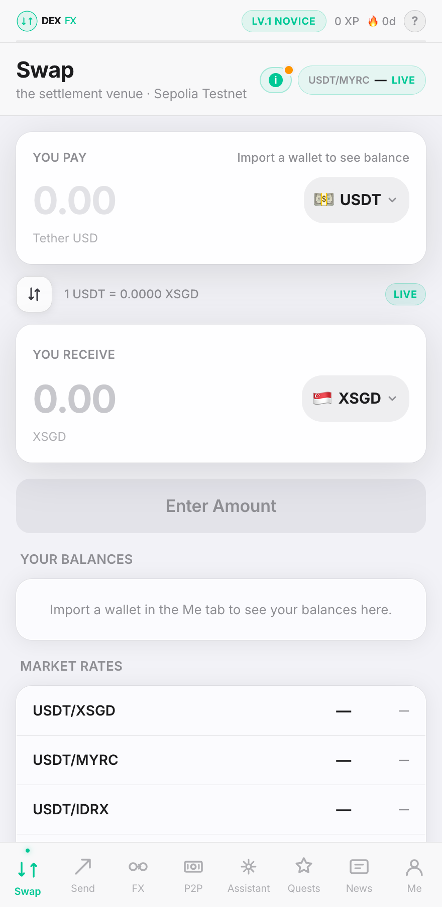

<div align="center">

# tg-dex-miniapp

### Stablecoin FX, a P2P money-changer market, and send-by-@username — inside Telegram, no app to download.

<a href="#"></a>
<a href="#"></a>
<a href="https://core.telegram.org/bots/webapps"></a>
<a href="./LICENSE"></a>

</div>

<div align="center"></div>

---

A [Telegram Mini App](https://core.telegram.org/bots/webapps) that gives anyone — with zero setup, inside a chat — a wallet that swaps stablecoins across currencies (USD/SGD/MYR/JPY/EUR/IDR), trades peer-to-peer with local money-changers through an escrow-grade settlement engine, sends money to a Telegram `@username`, on/off-ramps to fiat, earns yield, and levels up through quests. Everything settles through a **pluggable CLOB/RFQ FX venue** that you point at via one environment variable.

It is built for crypto, fintech, and remittance teams — especially those working **Southeast-Asia stablecoin corridors** — who already have (or are standing up) a settlement venue and want the hard parts done: the embedded wallet, key custody, EIP-712 signing, order orchestration, a real multi-leg escrow state machine, and a full Telegram-native UX.

**It's a client, not an exchange.** The settlement venue, token registry, branding, and auth all plug in through adapters and config — fork it, point it at your venue, ship your brand.

## What you can build

- **A no-download remittance app.** A worker in Singapore swaps USD stablecoins to SGD/MYR/JPY/IDR and settles with a local money-changer — entirely inside Telegram, no wallet to install, no seed phrase to write down.
- **A digital network of physical money-changers.** Each shop posts live, vault-backed buy/sell rates, earns an on-chain trust/completion score, and settles through a 16-state escrow burst that confirms the taker's payment on-chain *before* releasing the maker's funds.
- **Pay anyone by @username.** A freelancer or merchant shares a Telegram link; the recipient gets paid — even cross-currency (you send USDT, they receive XSGD) — without ever exchanging wallet addresses. If they aren't on the app yet, it falls back to a claimable deep link.
- **A retail FX desk on Telegram.** Embedded wallet and EIP-712 signing hidden behind a one-tap swap, with live oracle rates, side-by-side CLOB and shop routes, anchor-routing savings, and an explorer link on completion.
- **A grounded FX copilot + auto-trader.** An in-app AI assistant grounded in the user's real balances and live edge-vs-oracle, plus an opt-in agent that executes a single bounded swap on the user's behalf and logs the P&L.
- **A pooled yield product.** An ERC-4626-style vault where users deposit USDC and a bot market-makes around the oracle mid for them, with NAV accounting, performance fees, and risk caps.
- **A community growth loop.** Bootstrap the marketplace with quests, XP, points, badges, and referrals — beta-gated so nothing circulates before your mainnet launch, and so testers don't lose progress at the cutover.

## Features

Every feature below is implemented in this repo. Anything gated, custodial, or simulated by default is called out precisely in [Status](#status--whats-real-vs-stubbed). The nav labels don't always match the file names, so they're noted inline.

### Wallet, keys & custody

- **Embedded non-custodial wallet with real key crypto.** `ethers` `Wallet.createRandom()` secp256k1 keypairs; private keys are AES-256-GCM encrypted (PBKDF2 100k iters, per-wallet 12-byte IV, stored as `base64(iv + authTag + ciphertext)`). Encryption uses a **dedicated `KEY_ENCRYPTION_SECRET` — not `JWT_SECRET`** — and the process **refuses to boot in production** if it's unset or under 16 chars. This closes an audit finding where the session-signing secret could have decrypted every wallet. Privy embedded wallets are supported as an alternative auth/signing path. (`server/lib/crypto.ts`)
- **Two import paths; auto-generate is deliberately disabled.** You bring a wallet via `importWallet` (external address only) or `importPrivateKey` (paste a 64-hex key, **testnet-only**, refused when `FEATURE_MAINNET=true`). On private-key import the server derives the address, AES-encrypts and stores the key, provisions a venue API key via a `ManageApiKey` EIP-712 signature, enables a managed-wallet caps row (so it can co-sign trades), and kicks off background testnet funding. `wallet.getOrCreate` returns `null` until a wallet is actually imported — there is no blank, app-minted wallet. (`server/routers/wallet.ts`)
- **Testnet auto-funding on import.** A background job (never awaited, so import returns instantly) sends ~0.2 Sepolia ETH from `TESTNET_FUNDER_PRIVATE_KEY` if the wallet is below 0.15 ETH, then has the user's own key call the venue faucet's `claimTo(self)` to mint all 117 testnet tokens. Progress is written to `users.testnetFundStatus` (`funding`/`ready`/`skipped`/`error`) and polled by the client. (`server/lib/dex/fundTestnetWallet.ts`)
- **Managed-wallet signing service with risk caps.** The server decrypts the stored key and signs ERC-20 transfers, vault deposits (approve-before-deposit + `waitForTransaction`), and the full **dual-signature withdraw** (sign `WithdrawIntent` → executor co-sign → build → sign → send). Every signature re-checks `managed_wallet_caps`: enabled flag, kill switch, per-trade USD cap, daily volume cap + window, token allowlist, and consecutive-failure auto-pause. (`server/lib/dex/walletSigner.ts`, `swapSigner.ts`)

### FX swaps & routing

- **Swap tab — live FX swaps with route comparison.** The shipped live path is the server-signed `swapManaged` mutation (managed imported wallet): quote → sign EIP-712 `Intent` (plus EIP-2612 `Permit` when present) → `POST /swap`. The UI shows live oracle rates, a rotating pair ticker, and the reconstructed **live CLOB routes** (`dex.liveOrders`) *alongside* **trusted shop routes** (`p2p.shopRoutes`), and can deep-link "trade with a shop" into the FX tab. `dex.bestRoute` compares a direct swap vs one routed through a USDC/USDT anchor and returns the savings in bps. (`server/routers/dex.ts`, `client/src/pages/tabs/SwapTab.tsx`)
- **Live rates board + opportunity/edge radar.** `dex.liveBoard` reads the live CLOB for SEA pairs using a **`marginalRate` trick**: a single quote is distorted by the venue's fixed per-trade fee (reads ~0.94 when the true rate is 1.26), so it ladders two probe sizes and takes the slope to cancel the fee — a genuine market-microstructure detail. `dex.opportunities` compares executable rate vs FX oracle mid per direction to surface "deals" (edge ≥10 bps) and same-fiat "depegs". `dex.rateHistory` serves the time series the rate-log cron records — the historical rates the live API can't answer. (`server/routers/dex.ts`, `server/lib/dex/analysis.ts`)
- **Full venue REST orchestration.** The `dex` router wraps the venue API end to end: `serverTime`, `markets`, `tokens`, cached `bootstrap`/`config` (chainId + contract addresses + EIP-712 domain, with a graceful sentinel fallback), API-key create/revoke/self-revoke, `swapQuote`/`swapExecute` (with documented `error_code` → friendly-message remapping, incl. `SLIPPAGE_EXCEEDED`/`STP_BLOCKED`/`ALLOWANCE_INSUFFICIENT`, 410 quote-expired, 503 retry-after), order-status polling, permit metadata, deposit/approve build, `txSend`, order submit/cancel (5-min cooldown with `Retry-After` parsing), withdraw intent/build, transfer build, balances (with **self-healing 401 re-provision** of the API key), and `myFills`. (`server/routers/dex.ts`, `server/lib/dex/client.ts`)

### Send & payments

- **Send tab — three distinct flows.** (1) **Same-token transfer** (`dex.sendToken`, server-signed ERC-20 `/transfer`). (2) **Cross-currency send** (`swapManaged` with a custom recipient — you pay USDT, the recipient receives XSGD). (3) **Send to a Telegram `@username`**: `send.resolveRecipient` maps a handle → wallet (rate-limited to slow enumeration) for a **direct** send; if the user isn't found or has no wallet, it falls back to a shareable claim link (`send.createClaim` → nanoid UUID + `t.me` deep link, with expiry, an optional 140-char message, and a claim/cancel lifecycle). (`server/routers/send.ts`, `server/routers/dex.ts`, `client/src/pages/tabs/SendTab.tsx`)

### P2P money-changer market (the "FX" tab) & settlement

- **P2P marketplace.** Browse/post/edit/cancel swap/buy/sell ads; a changer profile is auto-created on the first ad; ordering is by promotion rank (pinned > highlighted > boosted > none via a SQL `CASE`, fixing an alphabetical-enum bug); per-pair filters. Anyone can post — not just registered changers. Ads carry liquidity/remaining, min/max order, terms, payment methods, and optional venue order linkage. (`server/routers/p2p.ts`, `client/src/pages/tabs/P2PTab.tsx`)
- **Vault-backed maker ads (`postAdLive`).** The real, server-orchestrated maker flow: it reads the maker's venue vault inventory, deposits the shortfall from their wallet (approve + deposit, server-signed) so the offer is genuinely backed, then inserts a `vault_available`-backed ad that **does not** post a CLOB limit order — an enforced invariant: P2P shops ≠ CLOB, and posting an order would freeze inventory and leak it to the anonymous book. `editAd` cancels any legacy on-book order and tops up the vault on a liquidity increase. (`server/routers/p2p.ts`)
- **3-leg coordinated stablecoin settlement engine — escrow-grade, not a demo.** This is the real P2P settlement. `shopSettlement.reserve` runs a **server-derived pre-check** (economics computed server-side from the ad + live venue state; the client only supplies `adId`/`amount`/`address`, blocking economic cheating), an atomic reservation debit with a 90s TTL, then `executeBurst` drives **Payment** (taker → maker) → **Release** (maker vault → taker) → **Recycle** (maker wallet → vault). It's a full **16-state machine** with idempotency keys, optimistic CAS status advance, a **TOCTOU maker-vault recheck before the taker pays**, **on-chain receipt verification** (polls Sepolia ~8×3s) so maker funds release only *after* the taker's payment confirms, and refund/recycle-retry fallbacks. (`server/routers/shopSettlement.ts`, `server/lib/dex/shopSettlement*.ts`, `drizzle/schema.ts`)
- **On-chain leg verification via JSON-RPC.** `confirmLeg`/`executeBurst` fetch the tx receipt and verify sender/recipient/token/amount against the leg's expected values (ERC-20 transfer for payment/refund, vault transfer for release/recycle) **before** advancing state; block number and gas are read from the receipt — client-supplied values are ignored. (`server/lib/dex/txVerifier.ts`, `server/routers/shopSettlement.ts`)

### Liquidity bots

- **Open Book Bot — continuous CLOB market-maker.** Re-posts real limit orders from the 22 seed shops at the live FX oracle mid + an 8 bps maker spread; each cycle re-checks every posted order and clears + reposts on fill/expiry (post → fill → repost loop). Each ad is capped to an 8000-unit slice (D1 inventory split — the rest stays `vault_available` for P2P), max 40 posts per cycle. This and the vault-backed P2P shops are **two deliberately separate liquidity systems** — the code repeatedly enforces "CLOB ≠ P2P shops, don't double-commit inventory." (`server/lib/dex/openBookBot.ts`, `orderSigner.ts`)
- **Pooled yield bot — Earn (ERC-4626-style).** Users deposit USDC into a bot-managed pool; shares are minted at NAV-per-share and withdrawals burn shares against current NAV. The bot posts paired limit orders around the oracle mid at a configurable spread (default 30 bps; default pairs USDT/XSGD, USDT/MYRC, USDT/IDRX). It tracks `yield_cycles` (NAV, pnlBps, performance fee on positive cycles), `yield_fills`, and per-user positions (`active`/`paused`/`pending_withdraw`) with risk caps (max pool, max per user, kill switch). The Earn UI lives as a sub-section inside the **Me** tab with a NAV chart — it is not a top-level tab. (`server/routers/yield.ts`, `server/lib/yield/strategy.ts`, `client/src/pages/sections/EarnSection.tsx`)

### AI & signals (the "Signals" tab)

- **Grounded in-app AI assistant.** The "Signals" tab is actually the assistant LLM chat. A `protectedProcedure` relays to Anthropic/OpenAI/Gemini (server-side keys; provider chosen by which key is set). The server builds a **live context block** before hitting the model: supported tokens, computed per-direction edge vs oracle, live SEA mids, the user's own vault + wallet balances, and — when inside a shop — the changer's active offers. Conversation persists across tab switches; 4 starter prompts. It's education/grounding, explicitly not a buy-now signal. (`server/routers/assistant.ts`, `server/lib/assistant/relay.ts`)
- **Trade-on-behalf AI agent.** `assistant.runTrade` scans SEA edges and, where the user *holds* the input token for a deal above `minEdge` (default 10 bps), executes **one bounded take** (≤ half the holding, ≤ `maxSize`) with the user's managed wallet via `signAndBroadcastSwap`, recording it to `agent_trades` for a P&L / track-record view. On-demand only — no unattended loop. (`server/lib/dex/tradeAgent.ts`, `server/routers/assistant.ts`)
- **FX "heat index" signal engine (3 pure strategies).** `best_rate` (ad beats oracle ≥5 bps), `stale_offer` (ad drifted ≥10 bps off-market — only shown to the poster), and `wide_spread` (best bid/ask spread ≥15 bps). Scored in bps with per-type TTLs (180/600/300s) and dedupe. A worker writes `bot_recommendations`; users have per-type subscriptions (min score, delivery via telegram/in-app/both, max-per-hour, pause); outcomes are tracked (delivered/viewed/ignored/acted/resulted_in_trade + realized PnL bps), feeding an admin success-rate backtest. (`server/lib/signals/strategies.ts`, `worker.ts`, `server/routers/signals.ts`)

### Fiat ramp (the "P2P"-labeled Cash tab)

- **zkP2P fiat on/off-ramp (real SDK, off by default).** Uses the real `@zkp2p/sdk` (`Zkp2pClient`) on Base mainnet (8453) USDC. **Browse + quotes are always visible to everyone**; only the real-money action buttons are gated by `moneyEnabled` (`FEATURE_PEER` + a Base RPC). Full surface: best quotes, liquidity orderbook, vaults, leaderboard, on-ramp `signalIntent` → `fulfillIntent` (Buyer-TEE / Reclaim proof), off-ramp `createDeposit` + `setAcceptingIntents`, intent/deposit tracking, optional referrer fee bps. Persists `peer_intents`/`peer_deposits`. (`server/routers/peer.ts`, `server/lib/peer/peerService.ts`, `client/src/pages/tabs/CashTab.tsx`)

### Growth, social & gamification

- **XP, 6 levels, points ledger, quests, badges.** Six levels (novice → legend) with XP thresholds; an immutable `points_transactions` ledger (referral_signup 100, referral_trade 50, trade_completed 10, quest 5, milestone 200, daily_login 2; floored at 0). **19 quests** (trading/send/p2p/streak/social/partner, incl. Asktian/YouApp partner visits and a repeatable share). **Beta-gating:** while `FEATURE_MAINNET=false`, non-referral quests record completion but accrue XP into `users.pendingQuestXp` — a cutover migration credits it at the mainnet flip, so testers don't lose progress. 13 badge definitions. (`server/routers/quests.ts`, `referral.ts`, `client/src/pages/tabs/QuestsTab.tsx`)
- **Referrals (off by default).** Unique per-user codes (`SFX{userId}{rand}`), Telegram deep-link, idempotent `trackSignup` with a self-referral guard, points to the referrer. Gated behind `FEATURES.referralSystem` (off, so links don't circulate pre-launch); the schema and procedures are always present. (`server/routers/referral.ts`)
- **Leaderboards, ratings & social links.** Volume / trust (reputation) / rates leaderboards, my-ranks, badge award. Post-trade 1–5 star ratings with comment (resolves the maker `userId` correctly from the changer profile — fixes an audit bug that credited the wrong user). Social account linking (X/WhatsApp/Gmail/Instagram/LinkedIn) awards per-platform XP + points on first link. (`server/routers/leaderboard.ts`, `p2p.ts`, `social.ts`)
- **Promotions — paid ad tiers.** Four tiers (none/boosted/highlighted/pinned), paid in USDT to `APP_TREASURY_WALLET`; the client broadcasts the transfer and passes the on-chain `txHash`, which is stored as an audit row in `promotions` and sets the ad's `promotionTier` + expiry. (`server/routers/p2p.ts`, `client/src/lib/dex/promotion.ts`)

### Platform — auth, Telegram, onboarding, infra

- **Dual authentication.** Primary: Telegram `initData` HMAC-SHA256 validation (data-check-string + `WebAppData` key) with 24h freshness, upserting the user and issuing a JWT cookie session. Alternative: Privy JWT verified against Privy's public JWKS (no app secret needed — `jose` `createRemoteJWKSet`, issuer/audience checks). Both at `/api/auth/*`. (`server/telegramAuth.ts`, `server/_core/oauth.ts`, `server/lib/auth/privy.ts`)
- **Telegram bot integration.** Webhook gated by the Telegram `secret_token` header (timing-safe compare; lax fallback if unset); `/start` stores `chat_id`; inline-button callbacks (`confirm_received:{id}` / `raise_dispute:{id}`); `sendMessage`/`sendMessageWithButtons`; order notifications; `messageCounterparty` relays a DM to the right party (resolving maker `userId` from the changer profile, with an honest `no_chat` when they never started the bot); deep links via `getMiniAppUrl`. All no-ops without `TELEGRAM_BOT_TOKEN`. (`server/lib/telegram.ts`, `server/routers/p2p.ts`, `p2p-actions.ts`)
- **Onboarding — explainer videos + spotlight walkthroughs.** Per-tab HyperFrames explainer MP4s (swap/send/p2p/cash in `client/public/embeds`) auto-show once on first visit, else a spotlight walkthrough; a "?" button re-summons either. "Seen" state is persisted **server-side** (`onboarding.seen`/`markSeen` on `users.onboardingSeen`) because the Telegram WebView doesn't reliably keep `localStorage` — with a `localStorage` fast-path. Distinct `video:<tab>` vs `<tab>` flags. (`client/src/pages/MiniApp.tsx`, `server/routers/onboarding.ts`)
- **News tab.** Fetches from an external news API (`NEWS_API_URL`, tRPC-shaped response), 15-min in-memory cache, category filter + featured-only, graceful degrade to an empty list on upstream failure. (`server/routers/news.ts`)
- **Idempotent testnet seeder — 22 SEA money-changers.** Deterministic HD wallets from `SEED_MNEMONIC` (`m/44'/60'/0'/0/{index}`) so an off-chain funding script can pre-fund the exact addresses; synthetic `telegramId`s 90000000–99999999; provisions each shop's venue API key; caps ad liquidity to vault backing. Auto-runs on boot (testnet only) when the count mismatches or ads are stale/over-advertised; manual `/internal/seed/run`. (`server/lib/seed.ts`, `server/_core/index.ts`)
- **In-process schedulers + internal cron endpoints.** Testnet in-process loops with re-entrancy guards and staggered first runs: openbook 90s, book-scan 180s, rate-log 300s, fills 30s, shop-settlement 60s, yield 600s — replacing a third-party cron so `JWT_SECRET` never leaves the server. Plus `/internal/*` HTTP endpoints (signals/yield/fills/seed/shop-settlement/openbook/rate-log/book-scan) gated by a constant-time `INTERNAL_CRON_SECRET` (falls back to `JWT_SECRET`). (`server/_core/index.ts`, `server/lib/dex/fillPoller.ts`, `bookScanner.ts`, `rateLog.ts`)
- **Pluggable settlement adapter + token registry.** The whole app depends on `DEX_API_BASE` + `GET /config` (chainId, vault/SOR/venue addresses, EIP-712 domain — fetched live, never hardcoded). An EIP-712 type registry (`Order`, `Intent`, `CancelOrder`, `CancelVLBatch`, `WithdrawIntent`, `ManageApiKey`, EIP-2612 `Permit`). Token registry: 10 Sepolia stables (5 tradeable: USDT/USDC/XSGD/JPYC/EURT) + a mainnet map; per-group rate limits; explorer URL helpers. (`shared/dex-api-config.ts`, `shared/venue-config.ts`)
- **S3 storage + in-memory rate limiting.** AWS S3 (`@aws-sdk/client-s3` + presigner) with a local-disk fallback for assets; a per-user in-memory rate limiter (`assertRateLimit`) applied to money signers, wallet import, bot messaging, the settlement burst, and the `@username` resolver. (`server/lib/production.ts`)

## Tech stack

| Layer | Tech |
|---|---|
| Frontend | React 19, Vite, Tailwind CSS v4, shadcn/ui, `@telegram-apps/sdk-react` |
| Backend | Express, tRPC v11, Drizzle ORM |
| Database | MySQL (Railway / PlanetScale / TiDB) |
| Wallet / signing | ethers v6 (secp256k1, EIP-712, AES-256-GCM), viem |
| Auth | Telegram `initData` + cookie sessions, or Privy embedded wallets (`jose` JWKS) |
| Settlement | Pluggable CLOB/RFQ venue via `DEX_API_BASE` (config + EIP-712 domain fetched live) |
| Fiat ramp | `@zkp2p/sdk` on Base mainnet USDC (off by default) |
| Telegram | `node-telegram-bot-api`, webhooks + deep links |
| AI | Anthropic / OpenAI / Gemini relay (provider by which key is set) |
| Storage | AWS S3 (`@aws-sdk/client-s3`) with local-disk fallback |

## Quickstart

```bash
git clone <your-fork-url> tg-dex-miniapp
cd tg-dex-miniapp
pnpm install
cp .env.example .env     # fill in DATABASE_URL, JWT_SECRET, KEY_ENCRYPTION_SECRET, TELEGRAM_BOT_TOKEN
pnpm db:push             # push the Drizzle schema to MySQL
pnpm dev                 # starts Express + Vite
```

On boot in testnet mode, the server auto-seeds 22 synthetic SEA money-changers (idempotent) and starts the in-process schedulers. Re-seed manually with `POST /internal/seed/run`.

**Required to run for real:** MySQL (`DATABASE_URL`), `JWT_SECRET`, a **separate `KEY_ENCRYPTION_SECRET`** (≥16 chars — the server refuses to boot in production without it), and `TELEGRAM_BOT_TOKEN`. To settle anything you also need a live venue at `DEX_API_BASE`, a real token registry, and an RPC URL. See `.env.example` for the full annotated list.

## Configuration

Swap any of these for your own providers — the app depends on the interface and config, not the implementation.

| Seam | Where | Default |
|---|---|---|
| Settlement venue | `DEX_API_BASE` + `GET /config` | placeholder host `api-testnet.your-venue.example` |
| Mainnet flag | `FEATURE_MAINNET` / `idea16_mainnet` in `shared/features.ts` | `false` (testnet only) |
| Wallet key crypto | `KEY_ENCRYPTION_SECRET` (≥16 chars, prod-fatal if unset) | none — you supply |
| Auth | `PRIVY_APP_ID` / `server/telegramAuth.ts` | Telegram `initData` + cookie sessions |
| Token registry | `shared/venue-config.ts` / `shared/dex-api-config.ts` | Sepolia testnet stables |
| Fiat ramp | `FEATURE_PEER` + zkP2P (`PEER_*`) | off, zkP2P staging host |
| AI assistant | `ANTHROPIC_API_KEY` / `OPENAI_API_KEY` / `GEMINI_API_KEY` | none (returns `SERVICE_UNAVAILABLE`) |
| RPC | `SEPOLIA_RPC_URL` / `MAINNET_RPC_URL` / Base RPC | none (you supply) |
| Internal cron | `INTERNAL_CRON_SECRET` | falls back to `JWT_SECRET` |
| Testnet funding | `TESTNET_FUNDER_PRIVATE_KEY`, `SEED_MNEMONIC` | none |
| News | `NEWS_API_URL` | none (degrades to empty) |
| Storage | `AWS_*` | local-disk fallback |
| Treasury | `APP_TREASURY_WALLET` | none |

## Make it yours

1. **Name & identity** — app name in `package.json`, `<title>` in `client/index.html`.
2. **Settlement venue** — point `DEX_API_BASE` at your CLOB/RFQ venue. The EIP-712 domain and on-chain addresses come live from the venue's `/config`; nothing is hardcoded.
3. **Tokens** — set your real token registry in `shared/venue-config.ts` / `shared/dex-api-config.ts` and supply an RPC URL; defaults are hardcoded Sepolia addresses.
4. **Auth** — leave Privy blank for Telegram `initData` + cookie sessions, or set `PRIVY_APP_ID` for embedded-wallet auth.
5. **Feature flags** — toggle mainnet, the zkP2P Cash ramp, referrals, and more in `shared/features.ts`.
6. **AI** — set any one of `ANTHROPIC_API_KEY` / `OPENAI_API_KEY` / `GEMINI_API_KEY` to light up the assistant; provider is chosen by which key is present.
7. **Telegram bot** — register with [@BotFather](https://t.me/BotFather), set `TELEGRAM_BOT_TOKEN`, then set the Mini App URL via `/newapp`.
8. **Strip the demo data** — the 22 seeded changers are synthetic personas in the reserved `telegramId` range 90000000–99999999. Remove them before going live.

## Status — what's real vs stubbed

Credibility over hype. Here's exactly what's live, what's gated, and what's a footgun.

- **It's a client, not a standalone exchange.** It requires a live settlement venue at `DEX_API_BASE`. The default is a **placeholder host** (`api-testnet.your-venue.example`); without a real venue, rates degrade to a "fallback" source and swaps can't settle.
- **Swaps are NOT simulated in the shipped build.** `DEMO_MODE` in the client `DemoGate` is `false`, and the live path is the server-signed `swapManaged`/`sendToken` (managed imported wallet), not the dead Privy client orchestrator. Older docs describing "demo mode = simulated swaps" describe a flag state, not what this client ships.
- **The managed testnet path is custodial-via-server.** Importing a key sends it to the backend in plaintext over the wire and stores it server-side (AES-encrypted) so the server can co-sign — despite the broader "non-custodial" framing. This path is **hard-blocked on mainnet**.
- **Mainnet is off by default** (`idea16_mainnet=false`). Tokens default to hardcoded Sepolia addresses; you must supply a real token registry and RPC.
- **The real P2P settlement is the 3-leg stablecoin vault burst — not fiat escrow.** Fiat buy/sell P2P (`placeOrder` with `adType` buy/sell) is deliberately forbidden/deprecated, and the legacy fiat-escrow `confirmReceived` refuses to mark a trade complete without a real on-chain release tx (it won't silently fake completion).
- **Dead stubs remain as footguns.** `server/lib/production.ts` still contains stubs that `throw 'TODO'` (`generateRealWallet`, `decryptPrivateKey`, `executeOnChainSwap`, `executeOnChainSend`, `getLiveP2PAds`, `authenticateViaTelegram`); `sendBotNotification`/`initTelegramBot` are also stubs. They're superseded by the working client/crypto/router code — don't wire them.
- **The zkP2P Cash ramp is off by default** (`FEATURE_PEER`) and points at the zkP2P **staging** host. Browse + quotes are visible to everyone, but no real Base-mainnet USDC liquidity is touched until you flip it.
- **Referrals are off by default.** The AI assistant returns `SERVICE_UNAVAILABLE` unless an LLM API key is set; News needs `NEWS_API_URL`.
- **Beta-gated quests still record completion** — XP is parked in `pendingQuestXp` and credited at the mainnet cutover; only referral quests pay XP immediately.
- **Yield/CLOB orders rarely fill organically on testnet.** The yield bot and some settlement workers depend on a configured bot key / managed-wallet signing, and with little external taker flow on testnet, posted CLOB orders may not fill (the code says so honestly).
- **Social-link "verification" is handle-entry only** (`isVerified` set true immediately, no real OAuth). Ratings and promotions store on-chain `txHash`es, but on-chain receipt verification for promotions is a noted follow-up.
- **Single-instance infra.** The in-memory rate limiter and in-process schedulers won't coordinate across multiple replicas without Redis / an external cron.

## License

MIT © 2026 — see [LICENSE](./LICENSE).
